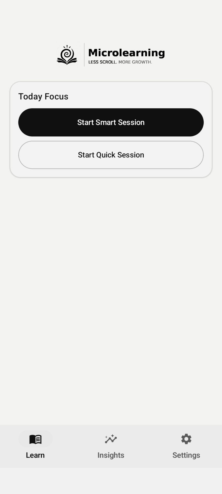
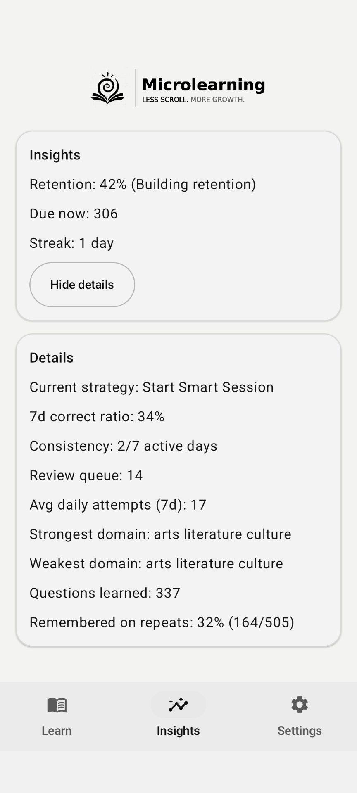
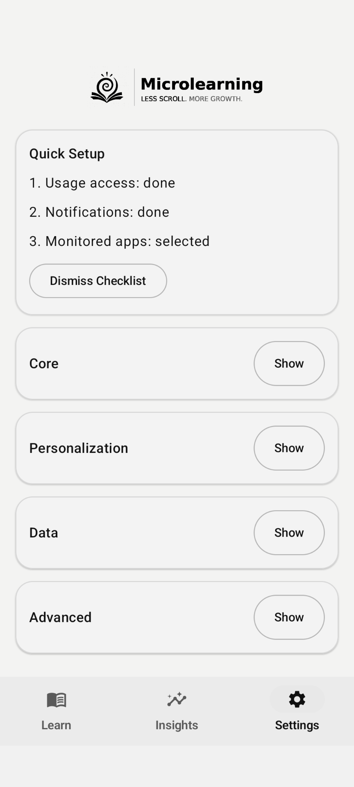

# microlearning-app

**microlearning-app** is an AI-powered Android microlearning app that turns short doomscroll windows into focused 3-15 minute learning sessions.

## Topics
`microlearning`, `android-app`, `edtech`, `digital-twin`, `adaptive-learning`, `spaced-repetition`, `retrieval-practice`, `learning-analytics`, `doomscroll-intervention`, `mobile-learning`

## Product Snapshot
- Platform: Android (mobile-first)
- Mode: Offline-first core experience
- Learning loop: Short adaptive sessions + spaced review
- Intervention model: Context-aware nudges with user control
- Design: Minimal, high-contrast, low-distraction UX
- Privacy posture: Public repo is showcase-only and IP-safe

This public repository is a product showcase and strategy layer.
It is intentionally limited to protect proprietary implementation and content IP.

License for this repository: see [LICENSE](LICENSE).
Third-party content policy: see [Third-Party Content](docs/THIRD_PARTY_CONTENT.md).

## Who This Is For
- Students who want fast, focused learning during short free windows
- Universities exploring digital twin-informed microlearning pilots
- L&D and training teams validating adaptive, mobile-first learning loops
- Research and product partners interested in timing-aware intervention systems

## Public Showcase
### Learn
- Fast session entry
- Smart session and quick session actions
- Minimal, distraction-free interface

### Insights
- Retention snapshot
- Due-now load
- Streak and core progress signals

### Settings
- Setup checklist
- Core controls and personalization entry points
- Data controls and advanced sectioning

## Why This Repo Exists
- Present product direction clearly for visibility.
- Share UX outcomes and product quality standards.
- Support collaboration and public-facing updates without exposing core IP.

## What Is Intentionally Not Included
- Full Android production source code.
- Full question bank and content pipeline datasets (including Wikipedia-derived production packs).
- Internal scoring/ranking policies and quality-gate thresholds.
- Proprietary adaptive learning and intervention logic internals.
- Private deployment and operations details.

See [IP Boundary](docs/IP_BOUNDARY.md).

## Proposal and Research Positioning
The product direction is informed by a context-aware student digital twin concept (timing-aware microlearning, event-centric context modeling, learner-in-control design).

To protect IP, this repository does **not** include the full proposal document.
Only non-confidential summary material is provided.

See [Public Proposal Summary](docs/PROPOSAL_PUBLIC_SUMMARY.md).

Public proposal page 1: [proposal-page-1-public.pdf](docs/proposal/proposal-page-1-public.pdf)

For the full proposal, contact: **available on request**.

## Public Docs
- [Public Changelog](CHANGELOG_PUBLIC.md)
- [Architecture Overview](docs/ARCHITECTURE_OVERVIEW.md)
- [Public Roadmap](docs/ROADMAP_PUBLIC.md)
- [Data Policy](docs/DATA_POLICY.md)
- [Publishing Checklist](docs/PUBLISHING_CHECKLIST.md)
- [Demo Media](docs/media/demo.md)

## Get in Touch / Request Access
For collaboration, pilot programs, proposal access, or beta interest:
- Request full proposal: see [Full Proposal Access](docs/proposal/FULL_PROPOSAL_REQUEST.md)
- Public contact email: `ADD_YOUR_EMAIL_HERE`
- Public intake form: `ADD_YOUR_FORM_LINK_HERE`
- Suggested use cases: university pilots, corporate learning pilots, investor evaluation

## Repository Scope
This repository is public-facing by design.
It should contain:
- product narrative,
- sanitized screenshots,
- roadmap-level updates,
- non-sensitive documentation.

It should not contain private code/data assets.
